# Neural Connection System Architecture (`NEURAL_SYSTEM.md`)

This document defines the **Neural Connection Architecture** of the `marketingskills` repository. It maps all **49 Agent Skills**, **51 Zero-Dependency CLI Tools**, **MCP Protocol Connectors**, **Composio OAuth Adapters**, and **Plugin Gateways** into an integrated, multi-layered neural network topology.

---

## 🧠 System Topology Overview

```
                      ┌──────────────────────────────────────────────────────────┐
                      │              AGENT INTERFACE GATEWAYS                    │
                      │   Claude Code (/plugin)  │  Codex (.codex-plugin)       │
                      │   Universal Spec (.agents/skills)                        │
                      └──────────────────────────┬───────────────────────────────┘
                                                 │ (Signal Ingestion)
                                                 ▼
                      ┌──────────────────────────────────────────────────────────┐
                      │            LAYER 1: CORE CONTEXT NUCLEUS                 │
                      │                 product-marketing                        │
                      │       (Positioning, ICP, Value Prop, Product Brief)      │
                      └──────────────────────────┬───────────────────────────────┘
                                                 │
                   ┌─────────────────────────────┴─────────────────────────────┐
                   ▼                                                           ▼
┌───────────────────────────────────────────┐             ┌───────────────────────────────────────────┐
│   LAYER 2A: STRATEGIC INTELLIGENCE        │             │   LAYER 2B: ANALYTICS & ATTRIBUTION       │
│  customer-research │ marketing-psychology │             │    analytics  │  attribution  │  ab-testing │
│  competitor-profiling │ competitors       │             └─────────────────────┬─────────────────────┘
│  marketing-plan │ marketing-council       │                                   │
└──────────────────┬────────────────────────┘                                   │
                   │                                                            │
 ┌─────────────────┼───────────────────────────┬────────────────────────────────┤
 ▼                 ▼                           ▼                                ▼
┌─────────────────────┐ ┌─────────────────────────┐ ┌───────────────────────┐ ┌───────────────────────┐
│  LAYER 3.1: SEO &   │ │ LAYER 3.2: CONVERSION   │ │ LAYER 3.3: COPY &     │ │ LAYER 3.4: PAID &     │
│     DISCOVERY       │ │      ENGINEERING        │ │   MEDIA GENERATION    │ │     GROWTH LOOPS      │
├─────────────────────┤ ├─────────────────────────┤ ├───────────────────────┤ ├───────────────────────┤
│ seo-audit           │ │ cro                     │ │ copywriting           │ │ ads                   │
│ ai-seo              │ │ signup                  │ │ copy-editing          │ │ ad-creative           │
│ site-architecture   │ │ onboarding              │ │ cold-email            │ │ referrals             │
│ programmatic-seo    │ │ popups                  │ │ emails                │ │ free-tools            │
│ schema              │ │ paywalls                │ │ social                │ │ churn-prevention      │
│ content-strategy    │ │ offers                  │ │ video                 │ │ community-marketing   │
│ aso                 │ │                         │ │ image / sms           │ │ lead-magnets / co-mktg│
└──────────┬──────────┘ └────────────┬────────────┘ └───────────┬───────────┘ └───────────┬───────────┘
           │                         │                          │                         │
           └─────────────────────────┼──────────────────────────┴─────────────────────────┘
                                     │ (Synaptic Motor Trigger)
                                     ▼
                      ┌──────────────────────────────────────────────────────────┐
                      │             LAYER 4: MOTOR EXECUTION SYNAPSES            │
                      │                                                          │
                      │  ┌────────────────────────────────────────────────────┐  │
                      │  │ 51 Zero-Dependency CLI Tools (tools/clis/*.js)     │  │
                      │  │ ga4, gsc, semrush, stripe, resend, google-ads, etc.│  │
                      │  └────────────────────────┬───────────────────────────┘  │
                      │                           │                              │
                      │  ┌────────────────────────┴───────────────────────────┐  │
                      │  │ Protocol Adapters & Composio OAuth Layer           │  │
                      │  │ Native MCP Servers + Composio MCP Bridge           │  │
                      │  └────────────────────────────────────────────────────┘  │
                      └──────────────────────────────────────────────────────────┘
```

---

## 🔀 Synaptic Routing & Inter-Skill Signal Paths

When an AI agent receives a user prompt, neural signals propagate across layers following defined directional paths:

```mermaid
graph TD
    GW["Gateway Layer (Claude Code / Codex / CLI)"] --> PM["Nucleus: product-marketing"]

    subgraph Intelligence Hub ["Layer 2: Intelligence & Strategy"]
        PM --> CR["customer-research"]
        PM --> MP["marketing-psychology"]
        PM --> CP["competitor-profiling"]
        PM --> MKP["marketing-plan"]
        PM --> AN["analytics & attribution"]
    end

    subgraph SEO_Cluster ["Layer 3.1: Organic Search & Discovery"]
        CR --> SA["site-architecture"]
        CP --> SEO["seo-audit"]
        SEO --> AISEO["ai-seo"]
        SEO --> PSEO["programmatic-seo"]
        SEO --> SCH["schema"]
    end

    subgraph CRO_Cluster ["Layer 3.2: Conversion Engineering"]
        MP --> CRO["cro"]
        CRO --> SU["signup"]
        CRO --> ONB["onboarding"]
        CRO --> POP["popups"]
        CRO --> PAY["paywalls"]
        CRO --> AB["ab-testing"]
    end

    subgraph Copy_Cluster ["Layer 3.3: Copy & Media"]
        CR --> CW["copywriting"]
        CW --> CE["copy-editing"]
        CW --> CEmail["cold-email"]
        CW --> EMsg["emails"]
        CW --> SOC["social"]
        CW --> VID["video"]
    end

    subgraph Growth_Paid_Cluster ["Layer 3.4 & 3.5: Growth, Paid & RevOps"]
        PM --> ADS["ads"]
        ADS --> ADC["ad-creative"]
        PM --> REF["referrals"]
        PM --> REV["revops"]
        REV --> SE["sales-enablement"]
        PM --> PRIC["pricing"]
    end

    subgraph Synapses ["Layer 4: Execution Synapses (tools/)"]
        SEO --> GSC_CLI["tools/clis/google-search-console.js"]
        SEO --> SEM_CLI["tools/clis/semrush.js"]
        AN --> GA4_CLI["tools/clis/ga4.js"]
        AB --> OPT_CLI["tools/clis/optimizely.js"]
        CEmail --> RESEND_CLI["tools/clis/resend.js"]
        REF --> STRIPE_CLI["tools/clis/stripe.js"]
        ADS --> GADS_CLI["tools/clis/google-ads.js"]
        REV --> HUBSPOT_MCP["Composio MCP (HubSpot / Salesforce)"]
    end
```



---

## ⚡ Neural Layer Specifications

### Layer 1: Context Nucleus (`product-marketing`)
- **Role**: Central activation hub containing product positioning, target audience personas, value proposition, and brand voice.
- **Synaptic Behavior**: Automatically loaded/checked by all other 48 skills to guarantee product-aligned outputs.

### Layer 2: Intelligence & Strategic Planning
- **Components**: `customer-research`, `marketing-psychology`, `competitor-profiling`, `competitors`, `marketing-plan`, `marketing-council`, `marketing-loops`, `analytics`, `attribution`.
- **Function**: Process raw market data into actionable strategic insights, user behavioral profiles, and campaign blueprints.

### Layer 3: Specialized Domain Clusters
1. **Search & AI Discovery**: `seo-audit`, `ai-seo`, `site-architecture`, `programmatic-seo`, `schema`, `content-strategy`, `aso`.
2. **Conversion Optimization**: `cro`, `signup`, `onboarding`, `popups`, `paywalls`, `offers`, `ab-testing`.
3. **Copy & Creative Generation**: `copywriting`, `copy-editing`, `cold-email`, `emails`, `social`, `video`, `image`, `sms`.
4. **Growth Engineering & Retention**: `referrals`, `free-tools`, `churn-prevention`, `community-marketing`, `lead-magnets`, `co-marketing`.
5. **Paid Acquisition & GTM**: `ads`, `ad-creative`, `revops`, `sales-enablement`, `launch`, `pricing`, `prospecting`, `public-relations`, `directory-submissions`.

### Layer 4: Motor Execution Synapses (`tools/`)
- **51 Zero-Dependency Node.js CLIs**: Instant programmatic execution (`node tools/clis/<tool>.js`).
- **Native MCP Servers**: GA4, Stripe, Mailchimp, Resend, Google Ads, Zapier, ZoomInfo, Clay.
- **Composio OAuth Layer**: Standardized MCP access to OAuth-heavy targets (HubSpot, Salesforce, Meta Ads, LinkedIn Ads, Slack).

---

## 🔄 Synaptic Feedback & Continuous Learning

1. **Analytical Feedback Loop**:
   `analytics` / `ga4` CLI ➔ `ab-testing` ➔ `cro` ➔ `copywriting` (Iterative improvement based on empirical conversion data).
2. **Demand Signal Feedback Loop**:
   `prospecting` / `customer-research` ➔ `product-marketing` ➔ `offers` (Refining product positioning based on live audience signals).
3. **Cross-Agent Plugin Synchronization**:
   `.agents/skills/` mirrors changes seamlessly to Claude Code (`.claude-plugin`) and OpenAI Codex (`.codex-plugin`).
